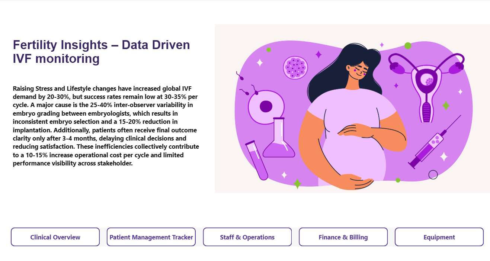

# Fertlity Insights: Data Driven IVF monitoring

This project analyzes **IVF clinical data**,to uncover trends in treatment outcomes, patient demographics, and operational efficiency. The objective is to help clinics improve success rates, patient experience, and resource utilization through data-driven insights.

## 📌 Clinical Overview
QuickBite experienced a sudden customer trust crisis, leading to a drop in orders, ratings, sentiment, and service performance.

## 📌 Patient Management Tracker

## 📌 Staff & Operations

## 📌 Finance & Billing

## 📌 Equipement

**This analysis aims to:**
- Analyzed patient demographics, treatment cycles, age groups, and success rates
- Identified key factors impacting IVF outcomes (age, treatment type, cycle count)
- Tracked clinic performance metrics such as success rate %, cancellation rate, and average cycles per patient
- Built interactive dashboards to monitor trends, comparisons, and KPIs
- Delivered actionable insights to support clinical and business decision-making
- The goal is to provide the management team with actionable insights to rebuild trust and stabilize operations.

## 🛠 Tools Used
- **Power BI** — Dashboard creation & visual analytics
- **Power Query** — Data cleaning & transformation
- **SQL** — Querying & analytics
- **Python** — Data Clensing 
  
## 📊 Dashboard Pages
- **Home Page**
- **Clinical Overview**
- **Patient Management Tracker**
- **Staff & Operations**
- **Finance & Billing**
- **Equipment management**

## 📧 Contact
**Created by Kiran Kapuram**  
🔗 **LinkedIn:** www.linkedin.com/in/kiran-kapuram
